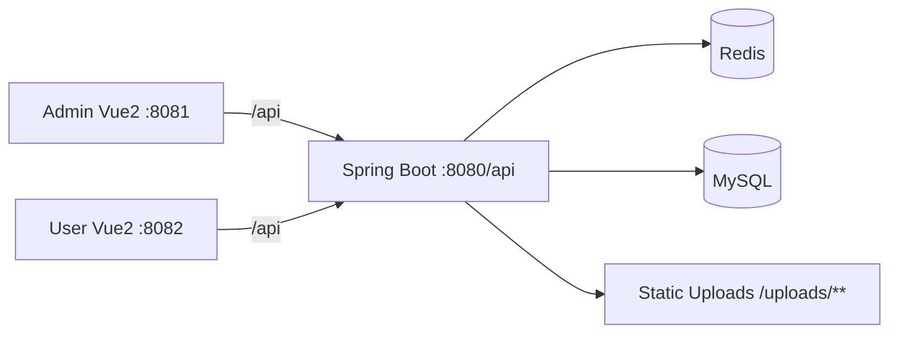
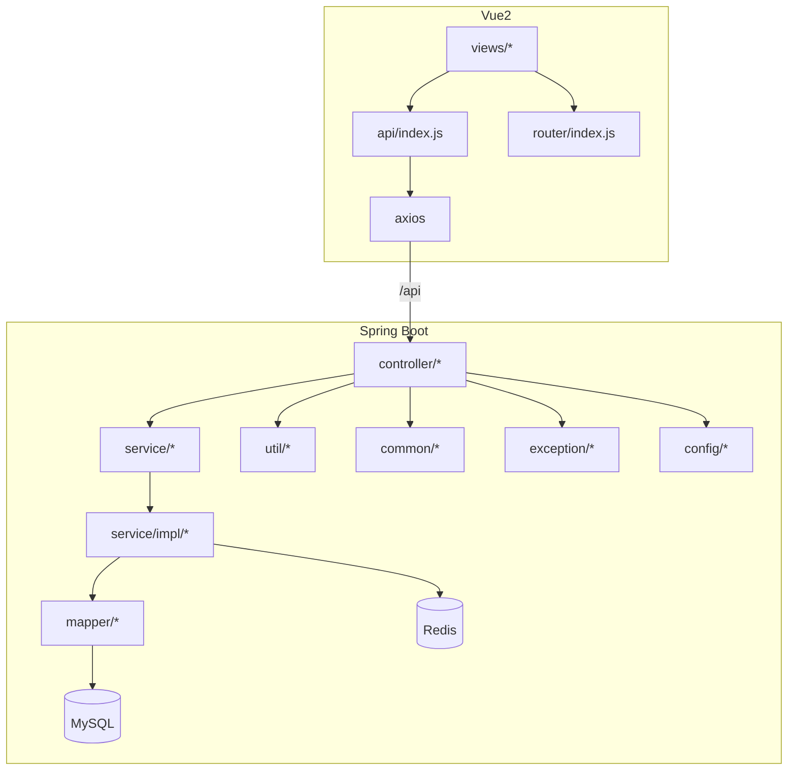

# 圣惟书店管理系统（Code Wiki）

仓库包含一个后端 Spring Boot 服务与两套前端 Vue2 应用（管理端/用户端），并提供 MySQL 初始化脚本。

## 1. 仓库结构

```
/workspace
  houduan/                 # 后端（Spring Boot + MyBatis-Plus + Redis）
  qianduan/
    admin/                 # 管理端（Vue2 + Element-UI）
    user/                  # 用户端（Vue2 + Element-UI）
  shengwei_bookstore.sql   # MySQL 初始化脚本
  README.md                # 基本为空
```

## 2. 总体架构

### 2.1 逻辑分层

- 前端（admin/user）负责 UI 与路由，调用后端 REST API（统一前缀 `/api`）
- 后端负责业务逻辑与数据访问：Controller → Service → Mapper → MySQL
- Redis 用于缓存（至少图书相关接口有显式缓存逻辑）

### 2.2 请求链路（高层）



### 2.3 关键约定

- 后端服务端口与前缀：[application.yml](file:///workspace/houduan/src/main/resources/application.yml#L1-L5)
  - `server.port: 8080`
  - `server.servlet.context-path: /api`
- 前端通过 devServer proxy 将 `/api` 代理到 `http://localhost:8080/api`
  - 管理端：[vue.config.js](file:///workspace/qianduan/admin/vue.config.js#L1-L16)
  - 用户端：[vue.config.js](file:///workspace/qianduan/user/vue.config.js#L1-L16)

## 3. 后端（houduan）详解

### 3.1 入口与包结构

- 启动入口：[TushuguanliApplication](file:///workspace/houduan/src/main/java/com/shengwei/tushuguanli/TushuguanliApplication.java#L11-L24)
- 主要包：
  - `config/`：Web、安全、Redis、MyBatis-Plus 等配置
  - `controller/`：REST API 入口
  - `service/`、`service/impl/`：业务服务接口与实现
  - `mapper/`：MyBatis-Plus Mapper
  - `entity/`：数据库实体与 VO
  - `common/`：统一返回体与分页结构
  - `exception/`：业务异常与全局异常处理
  - `util/`：JWT 工具等

### 3.2 核心依赖（Maven）

见 [pom.xml](file:///workspace/houduan/pom.xml#L32-L131)：

- `spring-boot-starter-web`：Web / REST API
- `spring-boot-starter-security`：安全框架（当前配置实际放行全部请求，见“问题清单”）
- `mybatis-plus-boot-starter`：ORM（BaseMapper/IService/分页插件）
- MySQL Driver：`mysql-connector-j`
- Druid：数据源与监控 `/druid/*`
- Redis：`spring-boot-starter-data-redis`
- JWT：`io.jsonwebtoken:jjwt`
- Hutool、POI、Jackson JavaTime

### 3.3 通用基础设施

#### 3.3.1 统一返回体与分页

- 统一返回体：[Result](file:///workspace/houduan/src/main/java/com/shengwei/tushuguanli/common/Result.java#L1-L81)
  - `Result.success(...) / Result.error(...)` 统一返回 `code/message/data/timestamp`
- 分页结构：`PageResult`、`PageQuery`（目录：[common](file:///workspace/houduan/src/main/java/com/shengwei/tushuguanli/common)）

#### 3.3.2 异常体系

- 业务异常：[BusinessException](file:///workspace/houduan/src/main/java/com/shengwei/tushuguanli/exception/BusinessException.java)
- 全局异常处理：[GlobalExceptionHandler](file:///workspace/houduan/src/main/java/com/shengwei/tushuguanli/exception/GlobalExceptionHandler.java#L1-L55)

#### 3.3.3 MyBatis-Plus 配置与审计字段

- 分页插件与自动填充：[MybatisPlusConfig](file:///workspace/houduan/src/main/java/com/shengwei/tushuguanli/config/MybatisPlusConfig.java#L16-L43)
  - `insertFill/updateFill` 自动填充 `createTime/updateTime/createBy/updateBy`
  - `getCurrentUserId()` 当前硬编码返回 `1L`（见“问题清单”）

#### 3.3.4 Redis 与缓存

- 图书模块有明确缓存策略：[BookInfoServiceImpl](file:///workspace/houduan/src/main/java/com/shengwei/tushuguanli/service/impl/BookInfoServiceImpl.java#L31-L397)
  - 详情缓存 `book:detail:{id}`、热销 `book:hot:{limit}`、新品 `book:new:{limit}`、分页 `book:page:{hash}`

#### 3.3.5 JWT

- JWT 工具类：[JwtUtil](file:///workspace/houduan/src/main/java/com/shengwei/tushuguanli/util/JwtUtil.java#L16-L86)
  - `generateToken(userId, username)`
  - `getUserIdFromToken(token)` / `validateToken(token)`
- JWT 配置：[application.yml](file:///workspace/houduan/src/main/resources/application.yml#L69-L75)

#### 3.3.6 文件上传与静态资源映射

- 上传 API：[FileUploadController](file:///workspace/houduan/src/main/java/com/shengwei/tushuguanli/controller/FileUploadController.java#L22-L114)
  - `POST /upload/bookCover`：图书封面，仅允许 `jpg/jpeg/png/gif`
  - `POST /upload/file`：通用上传，按 `type` 分类
- 静态映射：[WebConfig](file:///workspace/houduan/src/main/java/com/shengwei/tushuguanli/config/WebConfig.java#L13-L25)
  - `GET /uploads/**` 映射到 `file:${upload.path}/` 与 `classpath:/static/uploads/`

### 3.4 业务域（按 Controller 入口）

Controller 基本以 `@RequestMapping` 定义业务域前缀，目录：[controller](file:///workspace/houduan/src/main/java/com/shengwei/tushuguanli/controller)。

#### 3.4.1 认证与用户（Auth / SysUser）

- API：
  - `POST /auth/login`、`POST /auth/register`、`GET /auth/info` 等：[AuthController](file:///workspace/houduan/src/main/java/com/shengwei/tushuguanli/controller/AuthController.java)
- 核心登录逻辑：
  - [UserServiceImpl#login](file:///workspace/houduan/src/main/java/com/shengwei/tushuguanli/service/impl/UserServiceImpl.java#L29-L55)：校验密码后生成 JWT
  - 存在“明文密码兼容并自动升级”为 BCrypt 的逻辑（见“问题清单”）

#### 3.4.2 图书（Book）

- API：[BookController](file:///workspace/houduan/src/main/java/com/shengwei/tushuguanli/controller/BookController.java#L18-L164)
  - `GET /book/page`：分页检索（书名/作者/ISBN/出版社/分类/上下架/是否捐赠/排序）
  - `GET /book/hot`、`GET /book/new`：热销/新品
  - `GET /book/{id}`、`GET /book/isbn/{isbn}`：详情
  - `POST /book`、`PUT /book`、`DELETE /book/{id}`：增改删
  - `PUT /book/{id}/shelf?shelfStatus=...`：上下架
- 服务接口：[BookInfoService](file:///workspace/houduan/src/main/java/com/shengwei/tushuguanli/service/BookInfoService.java#L13-L59)
- 服务实现（缓存/校验/与库存联动）：[BookInfoServiceImpl](file:///workspace/houduan/src/main/java/com/shengwei/tushuguanli/service/impl/BookInfoServiceImpl.java#L31-L397)
  - `addBook` 创建图书后同步创建库存 `inventoryService.createInventory`

#### 3.4.3 购物车（Cart）

- API：`/cart/*`：[ShoppingCartController](file:///workspace/houduan/src/main/java/com/shengwei/tushuguanli/controller/ShoppingCartController.java)
- 服务接口：[ShoppingCartService](file:///workspace/houduan/src/main/java/com/shengwei/tushuguanli/service/ShoppingCartService.java#L11-L32)
- 关键逻辑：[ShoppingCartServiceImpl#getCartList](file:///workspace/houduan/src/main/java/com/shengwei/tushuguanli/service/impl/ShoppingCartServiceImpl.java#L49-L97)
  - 购物车条目与图书信息组装为 `CartItemVO`，并计算 `subtotal`

#### 3.4.4 订单与退款（Order）

- API：[TradeOrderController](file:///workspace/houduan/src/main/java/com/shengwei/tushuguanli/controller/TradeOrderController.java#L18-L96)
  - `POST /order/create`：基于购物车创建订单
  - `POST /order/pay`：支付（演示实现）
  - `GET /order/list`：用户订单列表
  - `GET /order/all`：全量订单（管理端）
  - `POST /order/refund/apply`、`GET /order/refund/list`、`POST /order/refund/handle`
- 服务接口：[TradeOrderService](file:///workspace/houduan/src/main/java/com/shengwei/tushuguanli/service/TradeOrderService.java#L13-L54)
- 服务实现（订单创建/支付/库存/会员/退款流转）：[TradeOrderServiceImpl](file:///workspace/houduan/src/main/java/com/shengwei/tushuguanli/service/impl/TradeOrderServiceImpl.java#L29-L319)

#### 3.4.5 库存（Inventory）

- API：`/inventory/*`：[InventoryController](file:///workspace/houduan/src/main/java/com/shengwei/tushuguanli/controller/InventoryController.java)
- 服务接口：[InventoryService](file:///workspace/houduan/src/main/java/com/shengwei/tushuguanli/service/InventoryService.java#L9-L49)
- 服务实现：[InventoryServiceImpl](file:///workspace/houduan/src/main/java/com/shengwei/tushuguanli/service/impl/InventoryServiceImpl.java#L15-L137)
  - `decreaseStock` 注释标注“演示系统允许负数”（见“问题清单/业务一致性”）

#### 3.4.6 捐赠（Donation）

- API：`/donation/*`：[DonationController](file:///workspace/houduan/src/main/java/com/shengwei/tushuguanli/controller/DonationController.java)
  - 以及捐赠申请/验收/人员等：`DonationApply*`、`DonationAccept*`、`DonationPerson*` 控制器
- 服务接口：[DonationService](file:///workspace/houduan/src/main/java/com/shengwei/tushuguanli/service/DonationService.java#L12-L43)
- 审核通过后联动创建图书与捐赠人榜单：[DonationServiceImpl#reviewDonation](file:///workspace/houduan/src/main/java/com/shengwei/tushuguanli/service/impl/DonationServiceImpl.java#L54-L114)

#### 3.4.7 会员（Member）

- API：`/member/*`：[MemberController](file:///workspace/houduan/src/main/java/com/shengwei/tushuguanli/controller/MemberController.java)
- 与订单支付联动：`memberService.updateMemberInfo(...)`（见 [TradeOrderServiceImpl](file:///workspace/houduan/src/main/java/com/shengwei/tushuguanli/service/impl/TradeOrderServiceImpl.java#L161-L166)）

#### 3.4.8 系统管理（Role/Menu/User）

- API：
  - 用户：`/sysUser/*`：[SysUserController](file:///workspace/houduan/src/main/java/com/shengwei/tushuguanli/controller/SysUserController.java)
  - 角色：`/role/*`：[SysRoleController](file:///workspace/houduan/src/main/java/com/shengwei/tushuguanli/controller/SysRoleController.java)
  - 菜单：`/menu/*`：[SysMenuController](file:///workspace/houduan/src/main/java/com/shengwei/tushuguanli/controller/SysMenuController.java)

### 3.5 数据访问层（Mapper）

- Mapper 以 `BaseMapper<T>` 为主，部分含注解 SQL（例如 [TradeOrderRefundMapper](file:///workspace/houduan/src/main/java/com/shengwei/tushuguanli/mapper/TradeOrderRefundMapper.java#L14-L25)）
- 配置声明了 XML mapper 路径，但 `resources/mapper/**/*.xml` 当前不存在（见“问题清单”）

## 4. 前端（qianduan）详解

### 4.1 两套应用的关系

- `/qianduan/admin`：管理端后台（图书/订单/捐赠/库存/会员/系统等）
- `/qianduan/user`：用户端（浏览/购物车/结算/订单/会员/捐赠等）
- 依赖栈基本一致：Vue2 + VueRouter + Vuex + Element-UI + axios
  - 管理端依赖：[admin/package.json](file:///workspace/qianduan/admin/package.json#L1-L54)
  - 用户端依赖：[user/package.json](file:///workspace/qianduan/user/package.json#L1-L55)

### 4.2 路由结构

- 管理端路由：[admin/router/index.js](file:///workspace/qianduan/admin/src/router/index.js#L6-L118)
  - `/login`
  - `/admin/*`：`AdminLayout` 下包含 `home/book/inventory/member/order/donation-manage/review/role/...`
- 用户端路由：[user/router/index.js](file:///workspace/qianduan/user/src/router/index.js#L6-L109)
  - `/login`、`/register`
  - `/customer/*`：`CustomerLayout` 下包含 `home/book/:id/cart/checkout/pay/order/member/donation/charity/password`

### 4.3 API 与请求封装

#### 4.3.1 通用 axios 封装（request.js）

- 管理端：[admin/src/utils/request.js](file:///workspace/qianduan/admin/src/utils/request.js#L1-L45)
- 用户端：[user/src/utils/request.js](file:///workspace/qianduan/user/src/utils/request.js#L1-L45)
- 关键行为：
  - 请求拦截：从 Vuex `store.state.token` 注入 `Authorization: Bearer ${token}`
  - 响应拦截：当 `res.code !== 200` 弹框并在 `401/403` 时登出并跳转登录页

#### 4.3.2 API 聚合（index.js）

- 管理端：[admin/src/api/index.js](file:///workspace/qianduan/admin/src/api/index.js)
- 用户端：[user/src/api/index.js](file:///workspace/qianduan/user/src/api/index.js)
- 典型接口对齐示例：
  - `book.pageList -> GET /book/page`（对应后端 [BookController](file:///workspace/houduan/src/main/java/com/shengwei/tushuguanli/controller/BookController.java#L28-L65)）
  - `auth.login -> POST /auth/login`（对应后端 AuthController）

### 4.4 状态管理（Vuex）

- 管理端：token 采用 `js-cookie` 持久化：[admin/src/store/index.js](file:///workspace/qianduan/admin/src/store/index.js#L7-L49)

### 4.5 本地开发端口与代理

- 管理端 `8081`：[admin/vue.config.js](file:///workspace/qianduan/admin/vue.config.js#L3-L15)
- 用户端 `8082`：[user/vue.config.js](file:///workspace/qianduan/user/vue.config.js#L3-L15)
- 代理规则：`/api -> http://localhost:8080/api`（本质上保持路径不变）

## 5. 运行方式（本地开发）

### 5.1 环境依赖

- 后端：JDK 8、Maven（与 Spring Boot 2.7 对齐）
- 前端：Node.js + npm（Vue CLI 5）
- 基础设施：MySQL、Redis

### 5.2 数据库初始化

- 导入脚本：[/shengwei_bookstore.sql](file:///workspace/shengwei_bookstore.sql)
- 注意：该脚本在开头存在明显语句问题（见“问题清单/数据库脚本”）

### 5.3 启动后端

在 `/workspace/houduan` 下：

```bash
mvn spring-boot:run
```

服务默认输出（启动类打印）：[TushuguanliApplication](file:///workspace/houduan/src/main/java/com/shengwei/tushuguanli/TushuguanliApplication.java#L16-L22)

- API：`http://localhost:8080/api`
- Druid：`http://localhost:8080/api/druid/`

配置文件路径：[application.yml](file:///workspace/houduan/src/main/resources/application.yml)

### 5.4 启动前端（管理端/用户端）

管理端（`/workspace/qianduan/admin`）：

```bash
npm install
npm run serve
```

用户端（`/workspace/qianduan/user`）：

```bash
npm install
npm run serve
```

## 6. 依赖关系（关键模块）



## 7. 问题清单（需要重点检查/修复）

### 7.1 安全与鉴权

- Spring Security 实际未启用鉴权：`anyRequest().permitAll()` 导致所有接口无需登录即可访问  
  - [SecurityConfig#filterChain](file:///workspace/houduan/src/main/java/com/shengwei/tushuguanli/config/SecurityConfig.java#L23-L32)
- CORS 配置重复且存在高风险组合
  - [SecurityConfig#corsConfigurationSource](file:///workspace/houduan/src/main/java/com/shengwei/tushuguanli/config/SecurityConfig.java#L34-L44)
  - [CorsConfig](file:///workspace/houduan/src/main/java/com/shengwei/tushuguanli/config/CorsConfig.java#L13-L27)

### 7.2 凭据泄露与环境可移植性

- 关键密码写入仓库配置（MySQL/Redis/Druid 管理员口令）  
  - [application.yml](file:///workspace/houduan/src/main/resources/application.yml#L9-L48)
- 上传路径硬编码为 Windows 绝对路径（Linux/容器环境不可用）  
  - [application.yml](file:///workspace/houduan/src/main/resources/application.yml#L76-L79)

### 7.3 数据库脚本

- 初始化 SQL 疑似无法直接执行：`use database` 语法与库名拼写存在问题（`shegnwei` vs `shengwei`）  
  - [shengwei_bookstore.sql](file:///workspace/shengwei_bookstore.sql#L23-L25)

### 7.4 MyBatis Mapper 配置一致性

- 配置声明 `mapper-locations: classpath*:/mapper/**/*.xml`，但 `resources/mapper/**/*.xml` 当前不存在  
  - [application.yml](file:///workspace/houduan/src/main/resources/application.yml#L55-L67)
- 部分 Mapper 声明了需要 XML 支撑的自定义方法（例如 [BookInfoMapper](file:///workspace/houduan/src/main/java/com/shengwei/tushuguanli/mapper/BookInfoMapper.java#L15-L26)），若被调用会在运行期报错

### 7.5 前后端 Token/响应处理不一致

- 管理端 `utils/request.js` 返回的是 `res`（含 `code/message/data`），而用户端 `api/index.js` 返回 `res.data`（只取 data），两套调用方式不统一  
  - 管理端：[admin/src/utils/request.js](file:///workspace/qianduan/admin/src/utils/request.js#L25-L37)
  - 用户端：[user/src/api/index.js](file:///workspace/qianduan/user/src/api/index.js#L27-L37)
- 用户端 `api/index.js` 从 `localStorage` 取 token，但用户端 `utils/request.js` 从 Vuex 取 token，存在并行的两套 token 来源  
  - [user/src/api/index.js](file:///workspace/qianduan/user/src/api/index.js#L12-L19)
  - [user/src/utils/request.js](file:///workspace/qianduan/user/src/utils/request.js#L11-L18)

### 7.6 业务一致性与可观测性

- 审计字段 `createBy/updateBy` 当前硬编码为 1，无法反映真实用户  
  - [MybatisPlusConfig](file:///workspace/houduan/src/main/java/com/shengwei/tushuguanli/config/MybatisPlusConfig.java#L40-L43)
- 库存减少允许负数（注释标注“演示系统”），容易导致后续逻辑异常  
  - [InventoryServiceImpl#decreaseStock](file:///workspace/houduan/src/main/java/com/shengwei/tushuguanli/service/impl/InventoryServiceImpl.java#L57-L72)
- 后端代码中存在 `System.out.println(...)` 与 `e.printStackTrace()`，不利于生产环境日志治理  
  - 例：[TradeOrderServiceImpl](file:///workspace/houduan/src/main/java/com/shengwei/tushuguanli/service/impl/TradeOrderServiceImpl.java#L58-L167)，[FileUploadController](file:///workspace/houduan/src/main/java/com/shengwei/tushuguanli/controller/FileUploadController.java#L68-L71)

### 7.7 仓库卫生

- 后端 `target/` 编译产物被提交到仓库中（应加入忽略规则并清理）  
  - 路径：[houduan/target](file:///workspace/houduan/target)
- 用户端 `package.json` 存在自引用式本地依赖 `"shengwei-bookstore-frontend": "file:"`，可能导致 `npm install` 解析异常  
  - [user/package.json](file:///workspace/qianduan/user/package.json#L12-L22)

## 8. 可运行性校验说明

- 本环境对外网不可达，`mvn package` 无法从 Maven Central 拉取 `spring-boot-starter-parent:2.7.18`，因此无法在此处完成后端编译校验。
- 在具备网络的本地环境中，可优先执行 `mvn -DskipTests package` 验证依赖与编译；若希望离线构建，需要提前在本机缓存 Maven 依赖或配置私服镜像。
