# 圣惟书店管理系统 - 数据库ER图

## 数据库ER图

```mermaid
erDiagram
    %% 用户相关表
    sys_user ||--o{ sys_user_role : "拥有"
    sys_role ||--o{ sys_user_role : "包含"
    sys_role ||--o{ sys_role_menu : "拥有"
    sys_menu ||--o{ sys_role_menu : "包含"
    
    customer ||--o{ shopping_cart : "拥有"
    customer ||--o{ trade_order : "创建"
    customer ||--o{ donation_record : "发起"
    customer ||--o{ member_info : "关联"
    customer ||--o{ service_feedback : "提交"
    
    %% 图书相关表
    book_category ||--o{ book_info : "分类"
    book_info ||--o{ trade_order_item : "包含"
    book_info ||--o{ shopping_cart : "加入"
    book_info ||--o{ inventory : "库存"
    
    %% 订单相关表
    trade_order ||--|{ trade_order_item : "包含"
    trade_order ||--o{ trade_order_refund : "退款"
    
    %% 实体定义
    
    sys_user {
        bigint id PK "主键ID"
        varchar username "用户名"
        varchar password "密码"
        varchar nickname "昵称"
        bigint role_id FK "角色ID"
        int status "状态"
        datetime create_time "创建时间"
        datetime update_time "更新时间"
        int deleted "删除标记"
    }
    
    sys_role {
        bigint id PK "主键ID"
        varchar role_name "角色名称"
        varchar role_code "角色编码"
        varchar description "描述"
        datetime create_time "创建时间"
        datetime update_time "更新时间"
        int deleted "删除标记"
    }
    
    sys_menu {
        bigint id PK "主键ID"
        bigint parent_id "父菜单ID"
        varchar menu_name "菜单名称"
        varchar path "路径"
        varchar component "组件"
        varchar icon "图标"
        int sort_order "排序"
        int status "状态"
        datetime create_time "创建时间"
        datetime update_time "更新时间"
        int deleted "删除标记"
    }
    
    sys_user_role {
        bigint id PK "主键ID"
        bigint user_id FK "用户ID"
        bigint role_id FK "角色ID"
        datetime create_time "创建时间"
        int deleted "删除标记"
    }
    
    sys_role_menu {
        bigint id PK "主键ID"
        bigint role_id FK "角色ID"
        bigint menu_id FK "菜单ID"
        datetime create_time "创建时间"
        int deleted "删除标记"
    }
    
    customer {
        bigint id PK "主键ID"
        varchar username "用户名"
        varchar password "密码"
        varchar nickname "昵称"
        varchar phone "电话"
        varchar email "邮箱"
        varchar address "地址"
        datetime create_time "创建时间"
        datetime update_time "更新时间"
        int deleted "删除标记"
    }
    
    book_category {
        bigint id PK "主键ID"
        varchar category_name "分类名称"
        varchar description "描述"
        int sort_order "排序"
        int status "状态"
        datetime create_time "创建时间"
        datetime update_time "更新时间"
        int deleted "删除标记"
    }
    
    book_info {
        bigint id PK "主键ID"
        varchar book_name "书名"
        varchar author "作者"
        varchar isbn "ISBN"
        varchar publisher "出版社"
        decimal price "价格"
        bigint category_id FK "分类ID"
        int shelf_status "上架状态"
        int stock "库存"
        int is_hot "是否热销"
        int is_new "是否新品"
        int is_donation "是否捐赠"
        varchar cover_image "封面图片"
        text description "描述"
        datetime create_time "创建时间"
        datetime update_time "更新时间"
        int deleted "删除标记"
    }
    
    trade_order {
        bigint id PK "主键ID"
        varchar order_no "订单号"
        bigint user_id FK "用户ID"
        decimal total_amount "总金额"
        int status "状态"
        datetime payment_time "支付时间"
        varchar shipping_address "收货地址"
        varchar shipping_phone "收货电话"
        varchar shipping_name "收货人"
        datetime create_time "创建时间"
        datetime update_time "更新时间"
        int deleted "删除标记"
    }
    
    trade_order_item {
        bigint id PK "主键ID"
        bigint order_id FK "订单ID"
        bigint book_id FK "图书ID"
        int quantity "数量"
        decimal price "单价"
        datetime create_time "创建时间"
        datetime update_time "更新时间"
        int deleted "删除标记"
    }
    
    trade_order_refund {
        bigint id PK "主键ID"
        bigint order_id FK "订单ID"
        varchar order_no "订单号"
        decimal refund_amount "退款金额"
        int status "状态"
        varchar reason "退款原因"
        varchar remark "处理备注"
        datetime create_time "创建时间"
        datetime update_time "更新时间"
        int deleted "删除标记"
    }
    
    shopping_cart {
        bigint id PK "主键ID"
        bigint user_id FK "用户ID"
        bigint book_id FK "图书ID"
        int quantity "数量"
        datetime create_time "创建时间"
        datetime update_time "更新时间"
        int deleted "删除标记"
    }
    
    donation_record {
        bigint id PK "主键ID"
        bigint user_id FK "用户ID"
        int donation_type "捐赠类型"
        decimal donation_amount "捐赠金额"
        int status "状态"
        bigint reviewer_id FK "审核人ID"
        varchar review_remark "审核备注"
        datetime create_time "创建时间"
        datetime update_time "更新时间"
        int deleted "删除标记"
    }
    
    member_info {
        bigint id PK "主键ID"
        bigint user_id FK "用户ID"
        int member_level "会员等级"
        int points "积分"
        datetime create_time "创建时间"
        datetime update_time "更新时间"
        int deleted "删除标记"
    }
    
    inventory {
        bigint id PK "主键ID"
        bigint book_id FK "图书ID"
        int stock "库存数量"
        datetime create_time "创建时间"
        datetime update_time "更新时间"
        int deleted "删除标记"
    }
    
    service_feedback {
        bigint id PK "主键ID"
        bigint user_id FK "用户ID"
        text content "反馈内容"
        int status "状态"
        datetime create_time "创建时间"
        datetime update_time "更新时间"
        int deleted "删除标记"
    }
    
    %% 捐赠申请相关表
    donation_apply {
        bigint id PK "主键ID"
        bigint user_id FK "用户ID"
        int status "状态"
        datetime create_time "创建时间"
        datetime update_time "更新时间"
        int deleted "删除标记"
    }
    
    donation_apply_item {
        bigint id PK "主键ID"
        bigint apply_id FK "申请ID"
        varchar book_name "书名"
        varchar author "作者"
        int quantity "数量"
        datetime create_time "创建时间"
        int deleted "删除标记"
    }
    
    donation_accept {
        bigint id PK "主键ID"
        bigint apply_id FK "申请ID"
        int status "状态"
        datetime accept_time "接收时间"
        datetime create_time "创建时间"
        datetime update_time "更新时间"
        int deleted "删除标记"
    }
    
    donation_accept_item {
        bigint id PK "主键ID"
        bigint accept_id FK "接收ID"
        bigint book_id FK "图书ID"
        int quantity "数量"
        datetime create_time "创建时间"
        int deleted "删除标记"
    }
    
    donor_info {
        bigint id PK "主键ID"
        varchar donor_name "捐赠人姓名"
        varchar phone "联系电话"
        varchar address "地址"
        datetime create_time "创建时间"
        datetime update_time "更新时间"
        int deleted "删除标记"
    }
    
    book_review {
        bigint id PK "主键ID"
        bigint book_id FK "图书ID"
        bigint user_id FK "用户ID"
        int rating "评分"
        text content "评价内容"
        datetime create_time "创建时间"
        datetime update_time "更新时间"
        int deleted "删除标记"
    }
```

## 表关系说明

### 1. 用户权限关系

| 关系 | 说明 |
|------|------|
| `sys_user` 1:N `sys_user_role` | 一个用户可以拥有多个角色 |
| `sys_role` 1:N `sys_user_role` | 一个角色可以被多个用户拥有 |
| `sys_role` 1:N `sys_role_menu` | 一个角色可以拥有多个菜单权限 |
| `sys_menu` 1:N `sys_role_menu` | 一个菜单可以被多个角色访问 |

### 2. 顾客相关关系

| 关系 | 说明 |
|------|------|
| `customer` 1:N `shopping_cart` | 一个顾客可以有多个购物车商品 |
| `customer` 1:N `trade_order` | 一个顾客可以创建多个订单 |
| `customer` 1:N `donation_record` | 一个顾客可以发起多次捐赠 |
| `customer` 1:1 `member_info` | 一个顾客可以关联一个会员信息 |
| `customer` 1:N `service_feedback` | 一个顾客可以提交多条反馈 |

### 3. 图书相关关系

| 关系 | 说明 |
|------|------|
| `book_category` 1:N `book_info` | 一个分类可以包含多本图书 |
| `book_info` 1:N `trade_order_item` | 一本图书可以出现在多个订单商品项中 |
| `book_info` 1:N `shopping_cart` | 一本图书可以被多个顾客加入购物车 |
| `book_info` 1:1 `inventory` | 一本图书对应一条库存记录 |
| `book_info` 1:N `book_review` | 一本图书可以有多条评价 |

### 4. 订单相关关系

| 关系 | 说明 |
|------|------|
| `trade_order` 1:N `trade_order_item` | 一个订单可以包含多个商品项 |
| `trade_order` 1:N `trade_order_refund` | 一个订单可以申请多次退款 |

### 5. 捐赠申请关系

| 关系 | 说明 |
|------|------|
| `customer` 1:N `donation_apply` | 一个顾客可以提交多个捐赠申请 |
| `donation_apply` 1:N `donation_apply_item` | 一个捐赠申请可以包含多个图书项 |
| `donation_apply` 1:N `donation_accept` | 一个捐赠申请可以有多个接收记录 |
| `donation_accept` 1:N `donation_accept_item` | 一个接收记录可以包含多个图书项 |

## 核心表字段说明

### sys_user（系统用户表）

| 字段名 | 类型 | 说明 |
|--------|------|------|
| id | bigint | 主键ID |
| username | varchar | 用户名（唯一） |
| password | varchar | 密码（加密存储） |
| nickname | varchar | 昵称 |
| role_id | bigint | 关联角色表 |
| status | int | 状态（0-禁用，1-启用） |
| create_time | datetime | 创建时间 |
| update_time | datetime | 更新时间 |
| deleted | int | 逻辑删除标记 |

### customer（顾客表）

| 字段名 | 类型 | 说明 |
|--------|------|------|
| id | bigint | 主键ID |
| username | varchar | 用户名（唯一） |
| password | varchar | 密码（加密存储） |
| nickname | varchar | 昵称 |
| phone | varchar | 联系电话 |
| email | varchar | 邮箱地址 |
| address | varchar | 收货地址 |
| create_time | datetime | 创建时间 |
| update_time | datetime | 更新时间 |
| deleted | int | 逻辑删除标记 |

### book_info（图书信息表）

| 字段名 | 类型 | 说明 |
|--------|------|------|
| id | bigint | 主键ID |
| book_name | varchar | 书名 |
| author | varchar | 作者 |
| isbn | varchar | ISBN编号 |
| publisher | varchar | 出版社 |
| price | decimal | 价格 |
| category_id | bigint | 关联分类表 |
| shelf_status | int | 上架状态（0-下架，1-上架） |
| stock | int | 库存数量 |
| is_hot | int | 是否热销（0-否，1-是） |
| is_new | int | 是否新品（0-否，1-是） |
| is_donation | int | 是否捐赠图书（0-否，1-是） |
| cover_image | varchar | 封面图片路径 |
| description | text | 图书描述 |
| create_time | datetime | 创建时间 |
| update_time | datetime | 更新时间 |
| deleted | int | 逻辑删除标记 |

### trade_order（交易订单表）

| 字段名 | 类型 | 说明 |
|--------|------|------|
| id | bigint | 主键ID |
| order_no | varchar | 订单号（唯一） |
| user_id | bigint | 关联顾客表 |
| total_amount | decimal | 订单总金额 |
| status | int | 订单状态（0-待支付，1-已支付，2-已发货，3-已完成，4-已取消） |
| payment_time | datetime | 支付时间 |
| shipping_address | varchar | 收货地址 |
| shipping_phone | varchar | 收货电话 |
| shipping_name | varchar | 收货人姓名 |
| create_time | datetime | 创建时间 |
| update_time | datetime | 更新时间 |
| deleted | int | 逻辑删除标记 |

## 数据库设计原则

1. **主键设计**：所有表使用bigint类型的自增主键，保证唯一性和扩展性

2. **逻辑删除**：使用deleted字段实现软删除，便于数据恢复和审计

3. **时间戳**：所有表包含create_time和update_time字段，记录数据的创建和更新时间

4. **外键约束**：建立适当的外键关系，保证数据完整性

5. **索引优化**：在经常查询的字段上建立索引，提高查询性能

6. **字段命名**：采用下划线命名法，符合数据库命名规范