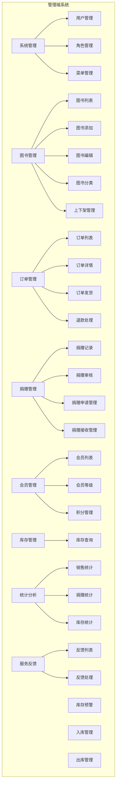
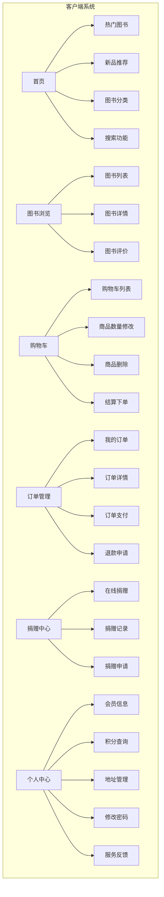
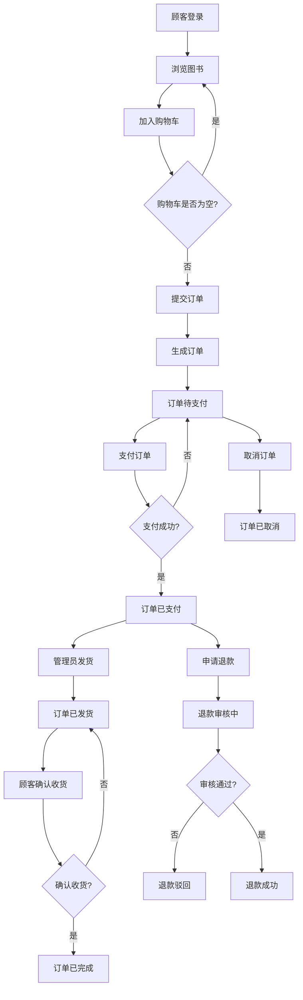
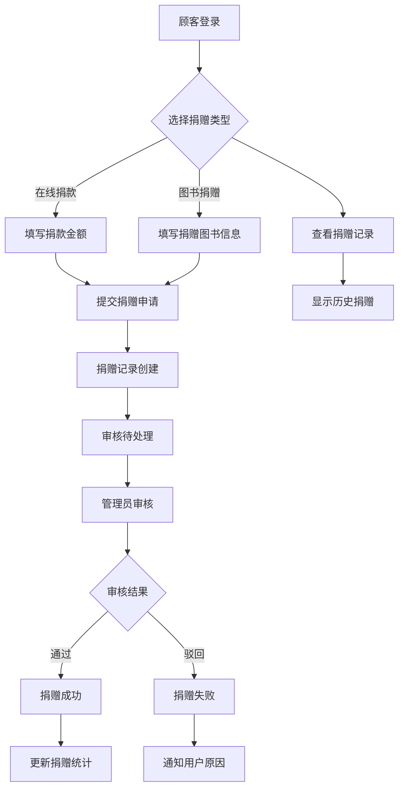
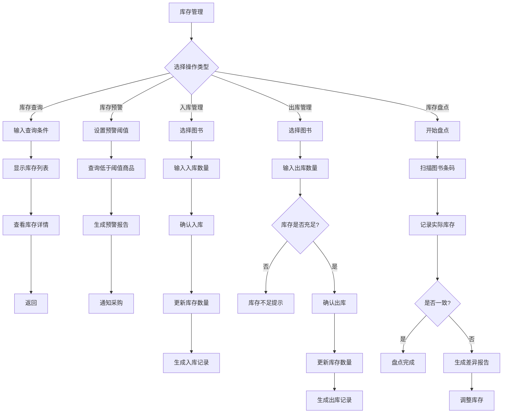
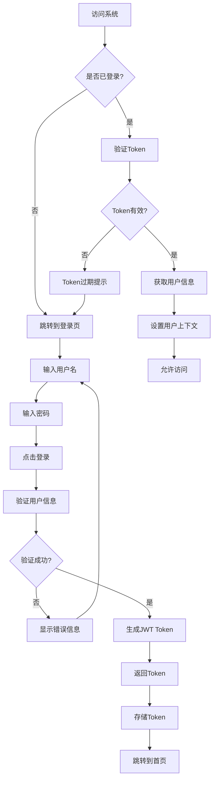
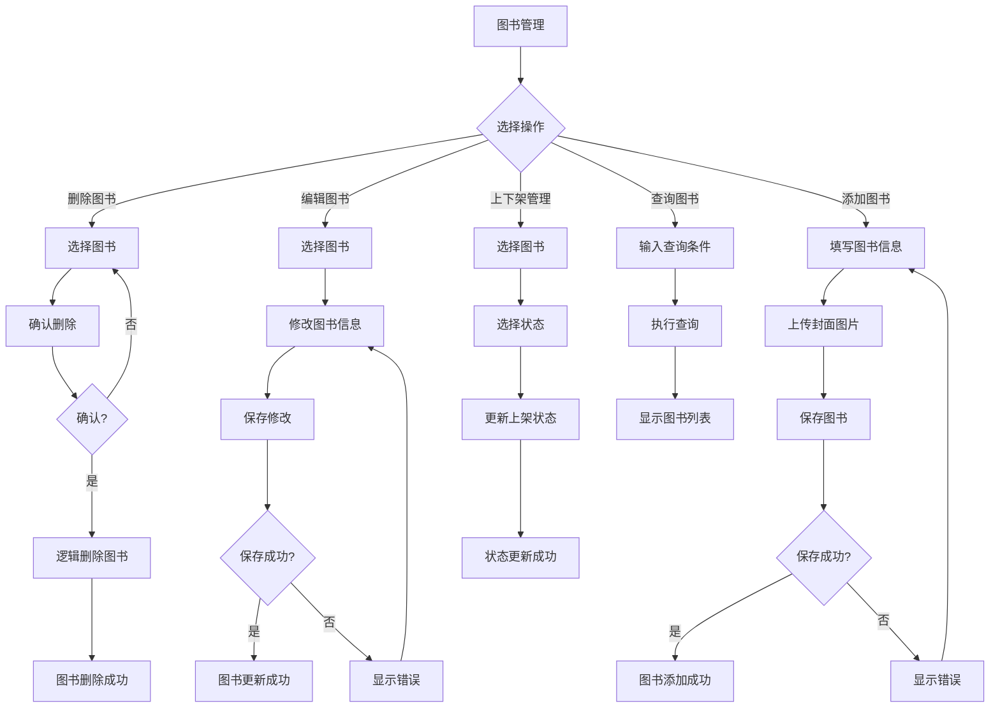
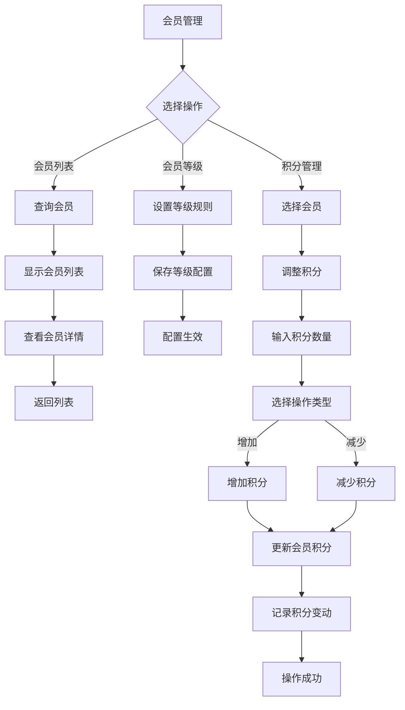
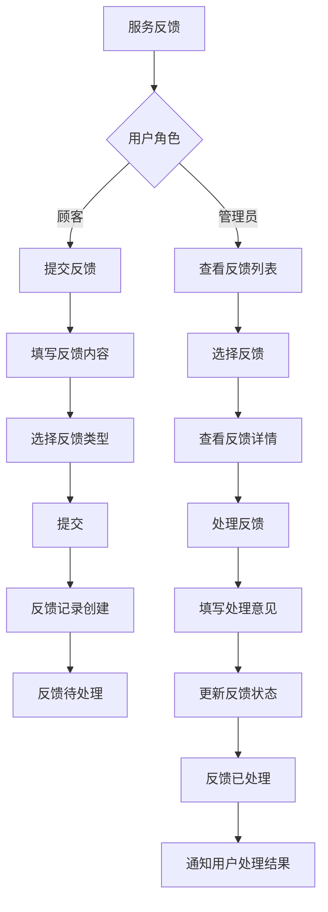
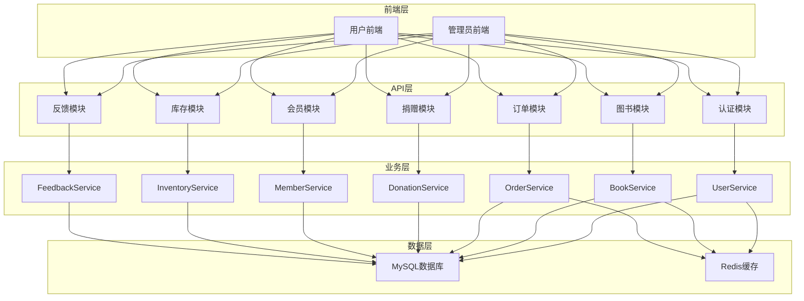

# 圣惟书店管理系统 - 功能模块图与业务流程图

## 1. 管理端功能模块图

```mermaid
graph TD
    subgraph 管理端系统
        A[系统管理] --> A1[用户管理]
        A --> A2[角色管理]
        A --> A3[菜单管理]
        
        B[图书管理] --> B1[图书列表]
        B --> B2[图书添加]
        B --> B3[图书编辑]
        B --> B4[图书分类]
        B --> B5[上下架管理]
        
        C[订单管理] --> C1[订单列表]
        C --> C2[订单详情]
        C --> C3[订单发货]
        C --> C4[退款处理]
        
        D[捐赠管理] --> D1[捐赠记录]
        D --> D2[捐赠审核]
        D --> D3[捐赠申请管理]
        D --> D4[捐赠接收管理]
        
        E[会员管理] --> E1[会员列表]
        E --> E2[会员等级]
        E --> E3[积分管理]
        
        F[库存管理] --> F1[库存查询]
        F2[库存预警]
        F3[入库管理]
        F4[出库管理]
        
        G[统计分析] --> G1[销售统计]
        G --> G2[捐赠统计]
        G --> G3[库存统计]
        
        H[服务反馈] --> H1[反馈列表]
        H --> H2[反馈处理]
    end
```

## 2. 客户端功能模块图

```mermaid
graph TD
    subgraph 客户端系统
        A[首页] --> A1[热门图书]
        A --> A2[新品推荐]
        A --> A3[图书分类]
        A --> A4[搜索功能]
        
        B[图书浏览] --> B1[图书列表]
        B --> B2[图书详情]
        B --> B3[图书评价]
        
        C[购物车] --> C1[购物车列表]
        C --> C2[商品数量修改]
        C --> C3[商品删除]
        C --> C4[结算下单]
        
        D[订单管理] --> D1[我的订单]
        D --> D2[订单详情]
        D --> D3[订单支付]
        D --> D4[退款申请]
        
        E[捐赠中心] --> E1[在线捐赠]
        E --> E2[捐赠记录]
        E --> E3[捐赠申请]
        
        F[个人中心] --> F1[会员信息]
        F --> F2[积分查询]
        F --> F3[地址管理]
        F --> F4[修改密码]
        F --> F5[服务反馈]
    end
```

## 3. 订单业务流程图

```mermaid
flowchart TD
    A[顾客登录] --> B[浏览图书]
    B --> C[加入购物车]
    C --> D{购物车是否为空?}
    D -->|是| B
    D -->|否| E[提交订单]
    E --> F[生成订单]
    F --> G[订单待支付]
    G --> H[支付订单]
    H --> I{支付成功?}
    I -->|否| G
    I -->|是| J[订单已支付]
    J --> K[管理员发货]
    K --> L[订单已发货]
    L --> M[顾客确认收货]
    M --> N{确认收货?}
    N -->|否| L
    N -->|是| O[订单已完成]
    
    G --> P[取消订单]
    P --> Q[订单已取消]
    
    J --> R[申请退款]
    R --> S[退款审核中]
    S --> T{审核通过?}
    T -->|否| U[退款驳回]
    T -->|是| V[退款成功]
```

## 4. 捐赠业务流程图

```mermaid
flowchart TD
    A[顾客登录] --> B{选择捐赠类型}
    B -->|在线捐款| C[填写捐款金额]
    B -->|图书捐赠| D[填写捐赠图书信息]
    
    C --> E[提交捐赠申请]
    D --> E
    
    E --> F[捐赠记录创建]
    F --> G[审核待处理]
    
    G --> H[管理员审核]
    H --> I{审核结果}
    I -->|通过| J[捐赠成功]
    I -->|驳回| K[捐赠失败]
    
    J --> L[更新捐赠统计]
    K --> M[通知用户原因]
    
    B --> N[查看捐赠记录]
    N --> O[显示历史捐赠]
```

## 5. 库存管理流程图

```mermaid
flowchart TD
    A[库存管理] --> B{选择操作类型}
    
    B -->|库存查询| C[输入查询条件]
    C --> D[显示库存列表]
    D --> E[查看库存详情]
    E --> F[返回]
    
    B -->|库存预警| G[设置预警阈值]
    G --> H[查询低于阈值商品]
    H --> I[生成预警报告]
    I --> J[通知采购]
    
    B -->|入库管理| K[选择图书]
    K --> L[输入入库数量]
    L --> M[确认入库]
    M --> N[更新库存数量]
    N --> O[生成入库记录]
    
    B -->|出库管理| P[选择图书]
    P --> Q[输入出库数量]
    Q --> R{库存是否充足?}
    R -->|否| S[库存不足提示]
    R -->|是| T[确认出库]
    T --> U[更新库存数量]
    U --> V[生成出库记录]
    
    B -->|库存盘点| W[开始盘点]
    W --> X[扫描图书条码]
    X --> Y[记录实际库存]
    Y --> Z{是否一致?}
    Z -->|是| AA[盘点完成]
    Z -->|否| AB[生成差异报告]
    AB --> AC[调整库存]
```

## 6. 用户认证流程图

```mermaid
flowchart TD
    A[访问系统] --> B{是否已登录?}
    B -->|是| C[验证Token]
    B -->|否| D[跳转到登录页]
    
    D --> E[输入用户名]
    E --> F[输入密码]
    F --> G[点击登录]
    G --> H[验证用户信息]
    H --> I{验证成功?}
    I -->|否| J[显示错误信息]
    J --> E
    I -->|是| K[生成JWT Token]
    K --> L[返回Token]
    L --> M[存储Token]
    M --> N[跳转到首页]
    
    C --> O{Token有效?}
    O -->|否| P[Token过期提示]
    P --> D
    O -->|是| Q[获取用户信息]
    Q --> R[设置用户上下文]
    R --> S[允许访问]
```

## 7. 图书管理流程图

```mermaid
flowchart TD
    A[图书管理] --> B{选择操作}
    
    B -->|添加图书| C[填写图书信息]
    C --> D[上传封面图片]
    D --> E[保存图书]
    E --> F{保存成功?}
    F -->|否| G[显示错误]
    G --> C
    F -->|是| H[图书添加成功]
    
    B -->|编辑图书| I[选择图书]
    I --> J[修改图书信息]
    J --> K[保存修改]
    K --> L{保存成功?}
    L -->|否| M[显示错误]
    M --> J
    L -->|是| N[图书更新成功]
    
    B -->|删除图书| O[选择图书]
    O --> P[确认删除]
    P --> Q{确认?}
    Q -->|否| O
    Q -->|是| R[逻辑删除图书]
    R --> S[图书删除成功]
    
    B -->|上下架管理| T[选择图书]
    T --> U[选择状态]
    U --> V[更新上架状态]
    V --> W[状态更新成功]
    
    B -->|查询图书| X[输入查询条件]
    X --> Y[执行查询]
    Y --> Z[显示图书列表]
```

## 8. 会员管理流程图

```mermaid
flowchart TD
    A[会员管理] --> B{选择操作}
    
    B -->|会员列表| C[查询会员]
    C --> D[显示会员列表]
    D --> E[查看会员详情]
    E --> F[返回列表]
    
    B -->|会员等级| G[设置等级规则]
    G --> H[保存等级配置]
    H --> I[配置生效]
    
    B -->|积分管理| J[选择会员]
    J --> K[调整积分]
    K --> L[输入积分数量]
    L --> M[选择操作类型]
    M -->|增加| N[增加积分]
    M -->|减少| O[减少积分]
    N --> P[更新会员积分]
    O --> P
    P --> Q[记录积分变动]
    Q --> R[操作成功]
```

## 9. 服务反馈流程图

```mermaid
flowchart TD
    A[服务反馈] --> B{用户角色}
    
    B -->|顾客| C[提交反馈]
    C --> D[填写反馈内容]
    D --> E[选择反馈类型]
    E --> F[提交]
    F --> G[反馈记录创建]
    G --> H[反馈待处理]
    
    B -->|管理员| I[查看反馈列表]
    I --> J[选择反馈]
    J --> K[查看反馈详情]
    K --> L[处理反馈]
    L --> M[填写处理意见]
    M --> N[更新反馈状态]
    N --> O[反馈已处理]
    
    O --> P[通知用户处理结果]
```

## 10. 系统整体架构图

```mermaid
graph TB
    subgraph 前端层
        A[管理员前端]
        B[用户前端]
    end
    
    subgraph API层
        C[认证模块]
        D[图书模块]
        E[订单模块]
        F[捐赠模块]
        G[会员模块]
        H[库存模块]
        I[反馈模块]
    end
    
    subgraph 业务层
        J[UserService]
        K[BookService]
        L[OrderService]
        M[DonationService]
        N[MemberService]
        O[InventoryService]
        P[FeedbackService]
    end
    
    subgraph 数据层
        Q[MySQL数据库]
        R[Redis缓存]
    end
    
    A --> C
    A --> D
    A --> E
    A --> F
    A --> G
    A --> H
    A --> I
    
    B --> C
    B --> D
    B --> E
    B --> F
    B --> G
    B --> H
    B --> I
    
    C --> J
    D --> K
    E --> L
    F --> M
    G --> N
    H --> O
    I --> P
    
    J --> Q
    K --> Q
    L --> Q
    M --> Q
    N --> Q
    O --> Q
    P --> Q
    
    J --> R
    K --> R
    L --> R
```