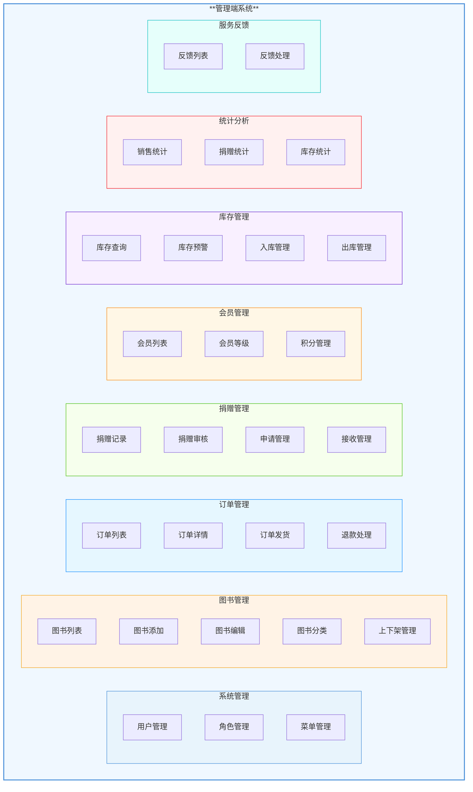
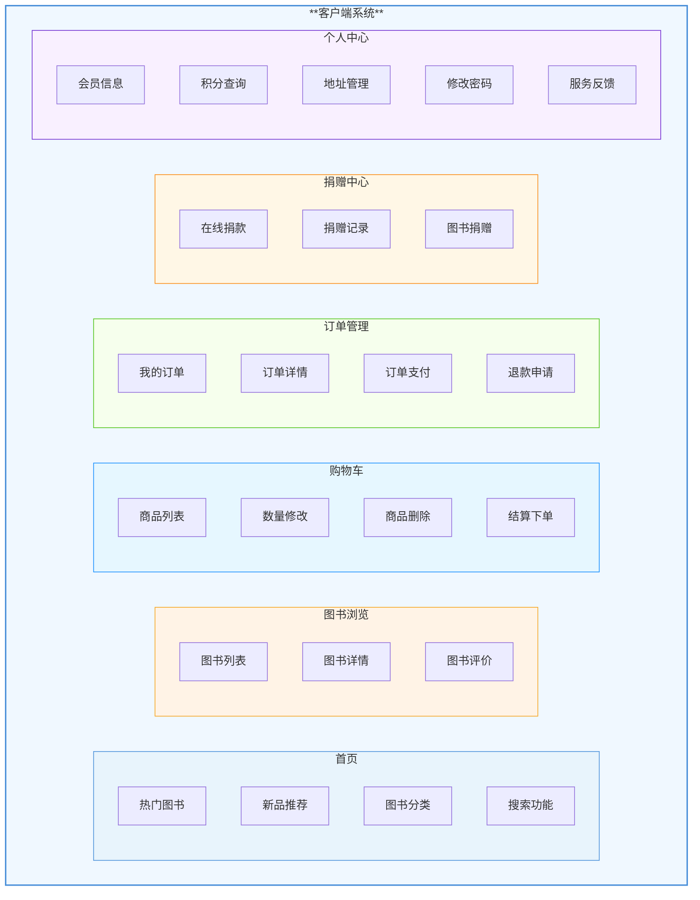
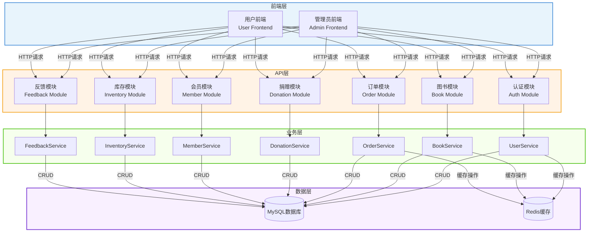

# 圣惟书店管理系统 - 功能模块图与业务流程图

---

## 图1 管理端功能模块图



---

## 图2 客户端功能模块图



---

## 图3 订单业务流程图

```mermaid
flowchart TD
    style start fill:#52c41a,color:#fff,stroke:#52c41a
    style end fill:#f5222d,color:#fff,stroke:#f5222d
    style decision fill:#1890ff,color:#fff,stroke:#1890ff
    style process fill:#fff,stroke:#d9d9d9
    
    A([顾客登录]):::start --> B[浏览图书]:::process
    B --> C[加入购物车]:::process
    C --> D{"购物车是否\n为空?"}:::decision
    D -->|是| B
    D -->|否| E[提交订单]:::process
    E --> F[生成订单]:::process
    F --> G[订单待支付]:::process
    G --> H[支付订单]:::process
    H --> I{"支付成功?"}:::decision
    I -->|否| G
    I -->|是| J[订单已支付]:::process
    J --> K[管理员发货]:::process
    K --> L[订单已发货]:::process
    L --> M[顾客确认收货]:::process
    M --> N{"确认收货?"}:::decision
    N -->|否| L
    N -->|是| O([订单已完成]):::end
    
    G --> P[取消订单]:::process
    P --> Q([订单已取消]):::end
    
    J --> R[申请退款]:::process
    R --> S[退款审核中]:::process
    S --> T{"审核通过?"}:::decision
    T -->|否| U([退款驳回]):::end
    T -->|是| V([退款成功]):::end
    
    classDef start fill:#52c41a,color:#fff,stroke:#52c41a,rx:10,ry:10
    classDef end fill:#f5222d,color:#fff,stroke:#f5222d,rx:10,ry:10
    classDef decision fill:#1890ff,color:#fff,stroke:#1890ff,rx:5,ry:5
    classDef process fill:#fff,stroke:#d9d9d9,rx:3,ry:3
```

---

## 图4 捐赠业务流程图

```mermaid
flowchart TD
    style start fill:#52c41a,color:#fff,stroke:#52c41a
    style end fill:#f5222d,color:#fff,stroke:#f5222d
    style decision fill:#1890ff,color:#fff,stroke:#1890ff
    style process fill:#fff,stroke:#d9d9d9
    
    A([顾客登录]):::start --> B{"选择捐赠类型"}:::decision
    B -->|在线捐款| C[填写捐款金额]:::process
    B -->|图书捐赠| D[填写捐赠图书信息]:::process
    
    C --> E[提交捐赠申请]:::process
    D --> E
    
    E --> F[捐赠记录创建]:::process
    F --> G[审核待处理]:::process
    
    G --> H[管理员审核]:::process
    H --> I{"审核结果"}:::decision
    I -->|通过| J[捐赠成功]:::process
    I -->|驳回| K[捐赠失败]:::process
    
    J --> L[更新捐赠统计]:::process
    L --> M([流程结束]):::end
    
    K --> N[通知用户原因]:::process
    N --> M
    
    B --> O[查看捐赠记录]:::process
    O --> P[显示历史捐赠]:::process
    P --> M
    
    classDef start fill:#52c41a,color:#fff,stroke:#52c41a,rx:10,ry:10
    classDef end fill:#f5222d,color:#fff,stroke:#f5222d,rx:10,ry:10
    classDef decision fill:#1890ff,color:#fff,stroke:#1890ff,rx:5,ry:5
    classDef process fill:#fff,stroke:#d9d9d9,rx:3,ry:3
```

---

## 图5 库存管理流程图

```mermaid
flowchart TD
    style start fill:#52c41a,color:#fff,stroke:#52c41a
    style end fill:#f5222d,color:#fff,stroke:#f5222d
    style decision fill:#1890ff,color:#fff,stroke:#1890ff
    style process fill:#fff,stroke:#d9d9d9
    
    A([库存管理]):::start --> B{"选择操作类型"}:::decision
    
    B -->|库存查询| C[输入查询条件]:::process
    C --> D[显示库存列表]:::process
    D --> E[查看库存详情]:::process
    E --> F([操作完成]):::end
    
    B -->|库存预警| G[设置预警阈值]:::process
    G --> H[查询低于阈值商品]:::process
    H --> I[生成预警报告]:::process
    I --> J[通知采购]:::process
    J --> F
    
    B -->|入库管理| K[选择图书]:::process
    K --> L[输入入库数量]:::process
    L --> M[确认入库]:::process
    M --> N[更新库存数量]:::process
    N --> O[生成入库记录]:::process
    O --> F
    
    B -->|出库管理| P[选择图书]:::process
    P --> Q[输入出库数量]:::process
    Q --> R{"库存是否\n充足?"}:::decision
    R -->|否| S[库存不足提示]:::process
    R -->|是| T[确认出库]:::process
    T --> U[更新库存数量]:::process
    U --> V[生成出库记录]:::process
    S --> F
    V --> F
    
    B -->|库存盘点| W[开始盘点]:::process
    W --> X[扫描图书条码]:::process
    X --> Y[记录实际库存]:::process
    Y --> Z{"是否一致?"}:::decision
    Z -->|是| AA([盘点完成]):::end
    Z -->|否| AB[生成差异报告]:::process
    AB --> AC[调整库存]:::process
    AC --> AA
    
    classDef start fill:#52c41a,color:#fff,stroke:#52c41a,rx:10,ry:10
    classDef end fill:#f5222d,color:#fff,stroke:#f5222d,rx:10,ry:10
    classDef decision fill:#1890ff,color:#fff,stroke:#1890ff,rx:5,ry:5
    classDef process fill:#fff,stroke:#d9d9d9,rx:3,ry:3
```

---

## 图6 用户认证流程图

```mermaid
flowchart TD
    style start fill:#52c41a,color:#fff,stroke:#52c41a
    style end fill:#f5222d,color:#fff,stroke:#f5222d
    style decision fill:#1890ff,color:#fff,stroke:#1890ff
    style process fill:#fff,stroke:#d9d9d9
    
    A([访问系统]):::start --> B{"是否已登录?"}:::decision
    B -->|是| C[验证Token]:::process
    B -->|否| D[跳转到登录页]:::process
    
    D --> E[输入用户名]:::process
    E --> F[输入密码]:::process
    F --> G[点击登录]:::process
    G --> H[验证用户信息]:::process
    H --> I{"验证成功?"}:::decision
    I -->|否| J[显示错误信息]:::process
    J --> E
    I -->|是| K[生成JWT Token]:::process
    K --> L[返回Token]:::process
    L --> M[存储Token]:::process
    M --> N[跳转到首页]:::process
    N --> O([允许访问]):::end
    
    C --> P{"Token有效?"}:::decision
    P -->|否| Q[Token过期提示]:::process
    Q --> D
    P -->|是| R[获取用户信息]:::process
    R --> S[设置用户上下文]:::process
    S --> O
    
    classDef start fill:#52c41a,color:#fff,stroke:#52c41a,rx:10,ry:10
    classDef end fill:#f5222d,color:#fff,stroke:#f5222d,rx:10,ry:10
    classDef decision fill:#1890ff,color:#fff,stroke:#1890ff,rx:5,ry:5
    classDef process fill:#fff,stroke:#d9d9d9,rx:3,ry:3
```

---

## 图7 图书管理流程图

```mermaid
flowchart TD
    style start fill:#52c41a,color:#fff,stroke:#52c41a
    style end fill:#f5222d,color:#fff,stroke:#f5222d
    style decision fill:#1890ff,color:#fff,stroke:#1890ff
    style process fill:#fff,stroke:#d9d9d9
    
    A([图书管理]):::start --> B{"选择操作"}:::decision
    
    B -->|添加图书| C[填写图书信息]:::process
    C --> D[上传封面图片]:::process
    D --> E[保存图书]:::process
    E --> F{"保存成功?"}:::decision
    F -->|否| G[显示错误]:::process
    G --> C
    F -->|是| H([图书添加成功]):::end
    
    B -->|编辑图书| I[选择图书]:::process
    I --> J[修改图书信息]:::process
    J --> K[保存修改]:::process
    K --> L{"保存成功?"}:::decision
    L -->|否| M[显示错误]:::process
    M --> J
    L -->|是| N([图书更新成功]):::end
    
    B -->|删除图书| O[选择图书]:::process
    O --> P[确认删除]:::process
    P --> Q{"确认?"}:::decision
    Q -->|否| O
    Q -->|是| R[逻辑删除图书]:::process
    R --> S([图书删除成功]):::end
    
    B -->|上下架管理| T[选择图书]:::process
    T --> U[选择状态]:::process
    U --> V[更新上架状态]:::process
    V --> W([状态更新成功]):::end
    
    B -->|查询图书| X[输入查询条件]:::process
    X --> Y[执行查询]:::process
    Y --> Z[显示图书列表]:::process
    Z --> AA([查询完成]):::end
    
    classDef start fill:#52c41a,color:#fff,stroke:#52c41a,rx:10,ry:10
    classDef end fill:#f5222d,color:#fff,stroke:#f5222d,rx:10,ry:10
    classDef decision fill:#1890ff,color:#fff,stroke:#1890ff,rx:5,ry:5
    classDef process fill:#fff,stroke:#d9d9d9,rx:3,ry:3
```

---

## 图8 系统整体架构图



---

## 图表说明

### 颜色规范
| 图表类型 | 颜色 | 说明 |
|---------|------|------|
| 开始节点 | 绿色 (#52c41a) | 流程的起始点 |
| 结束节点 | 红色 (#f5222d) | 流程的结束点 |
| 判断节点 | 蓝色 (#1890ff) | 决策分支点 |
| 处理节点 | 白色边框 (#d9d9d9) | 具体操作步骤 |
| 模块框 | 浅色填充 | 区分不同功能模块 |

### 使用建议
1. 本文档中的所有图表均使用Mermaid语法绘制
2. 在支持Mermaid的Markdown编辑器（如VS Code、Typora等）中可直接渲染
3. 如需导出为图片格式，可使用Mermaid在线工具或VS Code插件
4. 图表布局已优化，可直接用于毕业论文中

### 文档版本
- 版本：v1.0
- 生成日期：2026年4月28日
- 适用场景：圣惟书店管理系统毕业设计论文